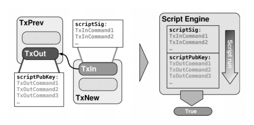

In this project, you will gain experience creating transactions using the Bitcoin testnet blockchain and Bitcoin Script. This project consists of 3 questions, each of which is explained below. The starter code we provide uses python-bitcoinlib, a free, low-level Python 3
library for manipulating Bitcoin transactions.

# 1. Project Background

## 1.1 Anatomy of a Bitcoin Transaction



Figure 1: Each TxIn references the TxOut of a previous transaction, and a TxIn is only valid if its
scriptSig outputs True when prepended to the TxOut’s scriptPubKey.

Bitcoin transactions are fundamentally a list of outputs, each of which is associated with an
amount of bitcoin that is “locked” with a puzzle in the form of a program called a scriptPubKey
(also sometimes called a “smart contract”), and a list of inputs, each of which references an output
from the list of outputs and includes the “answer” to that output’s puzzle in the form of a program
called a scriptSig. Validating a scriptSig consists of appending the associated scriptPubKey to it,
running the combined script and ensuring that it outputs True.

run(scriptSig || scriptPK) = True valid scriptSig, TxIn spend TxOut else invalid scriptSig, TxIn cannot spend TxOut

Most transactions are “PayToPublicKeyHash” or “P2PKH” transactions, where the scriptSig is a list of the recipient’s public key and signature, and the scriptPubKey performs cryptographic checks on those values to ensure that the public key hashes to the recipient’s bitcoin address and the signature is valid.

Each transaction input is referred to as a TxIn, and each transaction output is referred to as a TxOut. The situation for a transaction with a single input and single output is summarized by Figure 1 above.

The sum of the bitcoin in the unspent outputs to a transaction must not exceed the sum of the inputs for the transaction to be valid. The difference between the total input and total output is implicitly taken to be a transaction fee, as a miner can modify a received transaction and add an output to their address to make up the difference before including it in a block.

$$
\sum TxIn =\sum TxOut + Txfee
$$

For the first 3 questions in this project, the transactions you create will consume one input and create one PayToPublicKeyHash output that sends an amount of bitcoin back to the testnet faucet. For these exercises, you will want to take the fee into account when specifying how much to send and subtract a bit from the amount in the output you’re sending, say 0.001 BTC (this is just to be
safe, you can probably include a fee as low as 0.00001 BTC if your funds are running low). If you do not include a fee, it is likely that your transaction will never be added to the blockchain. Since BlockCypher (see Section 1.3) will delete transactions that remain unconfirmed after a day or two, it is very important that you include a fee to make sure that your transactions are eventually
confirmed.

## 1.2 Script Opcodes

Your code will use the Bitcoin stack machine’s opcodes, which are documented on the Bitcoin wiki [1]. When composing programs for your transactions’ scriptPubKeys and scriptSigs you may specify opcodes by using their names verbatim. For example, below is an example of a function that returns a scriptPubKey that cannot be spent, but rather acts as storage space for an arbitrary piece of data that someone may want to save to the blockchain using the **OP RETURN** opcode.

```
def save_message_scriptPubKey(message):
    return [OP_RETURN, message]
```

Examples of some opcodes that you will likely be making use of include **OP DUP**, **OP CHECKSIG**,
**OP EQUALVERIFY**, and **OP CHECKMULTISIG**, but you will end up using additional ones as well.

## Overview of Testnets

Rather than having you download the entire testnet blockchain and run a bitcoin client on your machine, we will be making use of an online block explorer to upload and view transactions. The one that we will be using is called BlockCypher, which features a nice web interface as well as an API for submitting raw transactions that the starter code uses to broadcast the transactions you create for the exercises. After completing and running the code for each exercise, BlockCypher will return a JSON representation of your newly created transaction, which will be printed to your terminal. An example transaction object along with the meaning of each field can be found at
BlockCypher’s developer API documentation at https://www.blockcypher.com/dev/bitcoin/#tx.

Of particular interest for the purposes of this project will be the hash, inputs, and outputs fields. Note that you will be using two different test networks (“testnets”) for this project: the Bitcoin testnet (the current version is Testnet3) for questions 1-3. These will be useful in testing your code. As part of these exercises, you will request coins to
some addresses (more details below).

# 2. Getting Started

1. Download the starter code (proj2.zip), navigate to the directory and intall the required dependencies by running:

```
pip install -r requirements.txt
```

For this project, ensure that you are using Python 3. If you are not using a Python virtual environment, you must do two things differently. First, use pip3 instead of pip to install packages to Python 3. Second, use the python3 command to run scripts instead of python to run with the Python 3 interpreter.

2.  Make sure you understand the structure of Bitcoin transactions and read the references in the Recommended Reading section below if you would like more information.
3.  Read over the starter code. Here is a summary of what each of the files contain:

    lib/keygen.py:

        You will run this script to generate new private keys and corresponding addresses for the Bitcoin Testnet. Questions 1-3 will solely use these private keys. You are not expected to modify this file.

    lib/split test coins.py:

        You will run this script to split your coins across multiple unspent transaction outputs (UTXOs). You will have to edit this file to input details about which transaction output you are splitting, the UTXO index, etc.

    lib/config.py:

        You will modify this file to include the private keys for your users. Note that my private key, alice secret key BTC and bob secret key BTC will be generated using the lib/keygen.py file. You will make web requests to generate alice secret key BCY and bob secret key BCY. There are comments in config.py and instructions during setup for how to do this.

    lib/utils.py:

        Contains various util methods. You are not expected to modify this file.

    Q1.py, Q2a.y, Q2b.py, Q3a.py, Q3b.py:

        You will have to modify the various scriptSig and scriptPubKey methods, as well as fill the transaction parameters. Note that for question 3, you will have to generate additional private and public keys for customers using the lib/keygen.py file.

    docs/transactions.py

        You are expected to fill this file with the transaction ids generated for questions 1-3.

4.  Be sure to start early on this project, as block confirmation times can vary depending on how
    busy the network is!

# 3. Setup

1. Open **lib/config.py** and read the file. Note that there are several users that you will need to generate private keys and addresses for.
2. First we are going to generate key pairs for you, Alice, and Bob on the Bitcoin Testnet. Run **lib/keygen.py** to generate private keys for **my_private_key**, and record these keys in **lib/config.py**.
   ```
   python lib/keygen.py
   ```
3. Next, we want to get some test coins for my private key and alice secret key BTC. To do so:

   a) Go to the Bitcoin Testnet faucet (https://testnet-faucet.com/) and paste in the corresponding addresses of the users. Note that faucets will often rate-limit requests for coins based on Bitcoin address and IP address, so try not to lose your test Bitcoin too often. It is recommended that you use the address associated with my private key with the first faucet listed above since that faucet gives more coins and you will be performing more exercises with that address. Note that the faucet limits requests by the same IP address to one every 12 hours.

   b) Record the transaction hash the faucet provides as you will need it later. Viewing the transaction in a block explorer (e.g. https://live.blockcypher.com/) will also let you know which output of the transaction corresponds to your address, and you will need this **utxo_index** for the next step as well. If the faucet doesn’t give you a transaction hash, you can also paste the user address into the block explorer and find the transaction that way.

4. The faucets will give you one spendable output per person, but we would like to have multiple outputs to spend in case we accidentally lock some with invalid scripts. Edit the parameters at the bottom of **split_test_coins.py**, where **txid_to_spend** is the transaction hash from the faucet to your address, **utxo_index** is 0 if your output was first in the faucet transaction and 1 if it was second, and n is the number of outputs you want your test coins split evenly into, and run the program with **python split_test_coins.py**. A perfect run through of questions 1-3 would require n = 3 for your address, one for each exercise, but if you anticipate accidentally locking an output due to a faulty script a couple times per exercise then you might want to set n to something higher like 8 so that you don’t have to wait to access the faucet again or have to try with a different Bitcoin address. If split test coins.py was successful, you should get back some information about the transaction. Record the transaction hash, as each exercise will be spending an output from this transaction and will refer to it using this hash.

   Note: The faucet transaction would need to be fully verified (at least 6/6 confirmations) before you can split the coins you received. Waiting times will vary based on how busy the network is.

5. At the end, verify that you created Bitcoin Testnet addresses for you. You should have some coins on this blockchain. Give yourself a pat on the back for finishing a long setup. Now it’s time to explore creating transactions with Bitcoin Script.

# 4. Questions

For each of the questions below, you will use the Bitcoin Script opcodes to create transactions.To
publish each transaction created for the exercises, edit the parameters at the bottom of the file to
specify which transaction output the solution should be run with along with the amount to send
in the transaction. If the scripts you write aren’t valid, an exception will be thrown before they’re
published. For questions 1-3, make sure to record the transaction hash of the created transaction
and write it to docs/transactions.py. After completing each exercise, look up the transaction
hash in a blockchain explorer to verify whether the transaction was picked up by the network. Make
sure that all your transactions have been posted successfully before submitting their hashes.

#### Exercise 1.

Open **Q1.py** and complete the scripts labelled with **TODOs** to redeem an output you own and send it back to the faucet with a standard PayToPublicKeyHash transaction. The faucet address is already included in the starter code for you. Your functions should return
a list consisting of only OP codes and parameters passed into the function.

```
def P2PKH_scriptPubKey(address):
    return [
        OP_DUP, OP_HASH160, address, OP_EQUALVERIFY, OP_CHECKSIG
    ]

```

```

def P2PKH_scriptSig(txin, txout, txin_scriptPubKey, private_key, public_key):
    signature = create_OP_CHECKSIG_signature(txin, txout, txin_scriptPubKey, private_key)

    return [
        signature, public_key
    ]

```

#### Exercise 2. For question 2, we will generate a transaction that is dependent on some constants.

a) Open **Q2a.py**. Generate a transaction that can be redeemed by the solution (x, y) to the following system of two linear equations:

```
x + y = (first half of your suid) and x − y = (second half or your suid)
```

For an integer solution to exist, the rightmost digit of the first and second halves of your suid must either be both even or both odd. Therefore, you can change the rightmost digit of the second half of your suid to match the evenness or oddness of the righmost digit of the first half. Make sure you use **OP_ADD** and **OP_SUB** in your scriptPubKey.

```
Q2a_txout_scriptPubKey = [
        OP_2DUP, OP_ADD, 32001, OP_EQUALVERIFY, OP_SUB, 2339, OP_EQUALVERIFY
    ]
```

b) Open **Q2b.py**. Redeem the transaction you generated above. The redemption script should be as small as possible. That is, a valid scriptSig should consist of simply pushing two integers x and y to the stack.

#### Exercise 3. Next, we will create a multi-sig transaction involving four parties.

a) Open **Q3a.py**. Generate a multi-sig transaction involving four parties such that the transaction can be redeemed by the first party (bank) combined with any one of the 3 others (customers) but not by only the customers or only the bank. You may assume the role of the bank for this problem so that the bank’s private key is your private key and the bank’s public key is your public key. Generate the customers’ keys using **lib/keygen.py** and paste them in **Q3a.py**.

```
Q3a_txout_scriptPubKey = [
    my_public_key, OP_CHECKSIGVERIFY, 1, cust1_public_key, cust2_public_key, cust3_public_key, 3, OP_CHECKMULTISIGVERIFY
]
```

b) Open **Q3b.py**. Redeem the transaction and make sure that the scriptSig is as small as possible. You can use any legal combination of signatures to redeem the transaction but make sure that all combinations would have worked

```
def multisig_scriptSig(txin, txout, txin_scriptPubKey):
    bank_sig = create_OP_CHECKSIG_signature(txin, txout, txin_scriptPubKey,
                                             my_private_key)
    cust1_sig = create_OP_CHECKSIG_signature(txin, txout, txin_scriptPubKey,
                                             cust1_private_key)
    cust2_sig = create_OP_CHECKSIG_signature(txin, txout, txin_scriptPubKey,
                                             cust2_private_key)
    cust3_sig = create_OP_CHECKSIG_signature(txin, txout, txin_scriptPubKey,
                                             cust3_private_key)

    return [
        OP_0, cust1_sig, bank_sig
    ]

```

# 5. Recommended Reading

1. Bitcoin Script: https://en.bitcoin.it/wiki/Script
2. Bitcoin Transaction Format: https://en.bitcoin.it/wiki/Transaction
3. Bitcoin Transaction Details: https://privatekeys.org/2018/04/17/anatomy-of-a-bitcoin-transaction/
